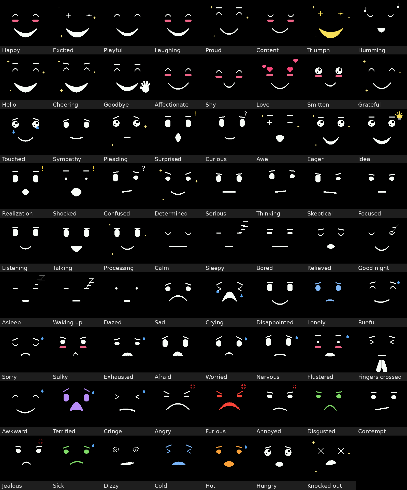
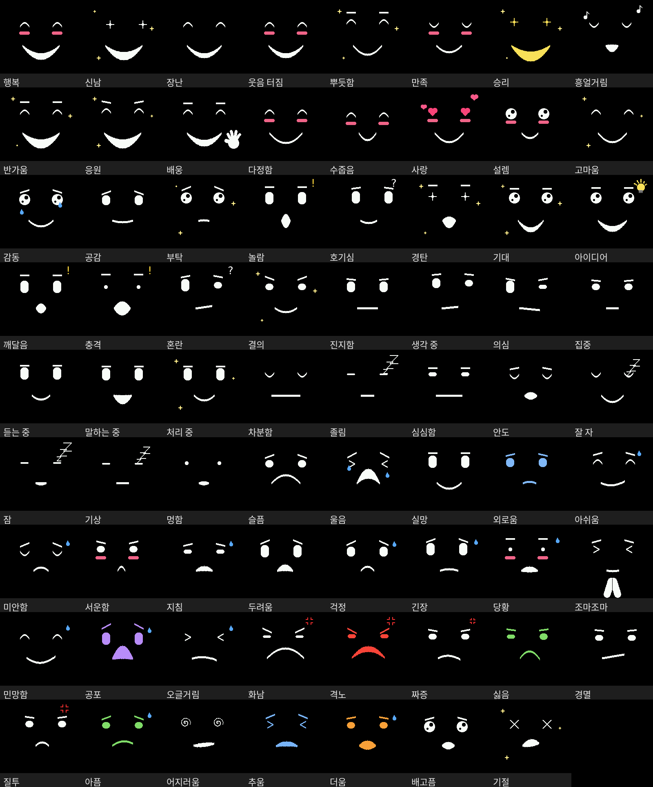

# AI Face

**A little face for your AI.** While you chat with Claude or ChatGPT (Codex), the AI picks a facial expression for each reply, and it shows up as an animated round face in your Mac's menu bar. Optionally, the same face can live on a small round LCD on your desk.

No hardware needed: the menu bar face works on its own. Everything runs locally on your Mac.



[한국어 설명은 아래에 있어요.](#한국어)

## What you get

- **71 animated moods** (happy, thinking, awkward, cheering, idea, fingers crossed, ...). The AI chooses one per reply through a local [MCP](https://modelcontextprotocol.io) server, so the face follows the tone of the conversation.
- **Who chose it**: the ring around the face is orange for Claude, green for GPT and white when you pick a face yourself. Monochrome mode shows it with ring patterns instead.
- **Menu**: click the face for a timer (pomodoro), campfire, clock and every mood.
- **Screen savers** when the face has not changed for a while: sleepy → asleep, clock, photo, slideshow, pixel-art campfire.
- **History**: a daily log of which AI made which face, with stats and a timeline. Only the mood and the time are saved, never conversation text. AIs can read it too ("how were our faces today?").
- **Round LCD (optional)**: Seeed XIAO ESP32S3 + 1.28" GC9A01 240×240 round display, firmware included (updated from the app, no Arduino IDE window needed) and a 3D-printable case in `hardware/housing`.
- English and Korean, following your Mac's language.

## Requirements

- macOS 13 or later, and the Xcode Command Line Tools (the app is compiled on your Mac)
- Claude desktop and/or Codex (Claude Code works too). Faces only change in chats on the Mac: the Claude mobile and web apps cannot reach a local MCP server.

## Install

1. Install the Xcode Command Line Tools if you do not have them: `xcode-select --install`
2. Get the code: `git clone https://github.com/jason401/ai-face.git` (or download the ZIP).
3. Double-click **`Build AI Face.command`**. It compiles `AI Face.app` in the folder and starts it: a face appears in the menu bar and the settings window opens. The app is built on your own Mac, so it opens without a Gatekeeper warning. (If you downloaded the ZIP, macOS may block the `.command` file the first time: right-click it → Open, or allow it in System Settings → Privacy & Security.)
4. In **Settings → AI apps**, click **Connect** next to Claude desktop and/or Codex, then quit (⌘Q) and reopen those apps. For Claude Code, click **Copy command** in the same tab and paste it into a terminal.

Keep `AI Face.app` in the project folder: it runs the Python code next to it.

### The round LCD (optional)

- Board: Seeed XIAO ESP32S3; display: GC9A01 240×240 round SPI LCD (pins in `firmware/ESP32_Display/ESP32_Display.ino`).
- Install Arduino IDE 2 with the ESP32 board package once. After that, **Settings → Board → Update firmware** compiles and uploads the firmware.
- Plug the board in and the app connects to it by itself.

## Privacy

- Nothing leaves your Mac except what the AI apps already send: when an AI calls a tool, the result (for example the mood history) becomes part of that chat.
- **Connect** adds one entry (`esp32-face`) to Claude desktop's and Codex's settings files, after making a backup copy; other settings are left alone.
- Data (settings, photos, history) lives in `~/Library/Application Support/ESP32Face/`.

## Uninstall

1. Settings → AI apps → **Disconnect** for each app (or `python3 tools/install_mcp.py --remove`), and turn off **Open at login** in Settings → General.
2. Quit AI Face from its menu, then delete the project folder and, if you want, `~/Library/Application Support/ESP32Face/`.

## How it works

```
Claude / Codex ──MCP (stdio)──▶ core/aiface/mcp_server.py ──HTTP (127.0.0.1)──▶ AI Face.app
                                                                                 ├─ menu bar face
                                                                                 └─ USB serial ─▶ ESP32 LCD
```

```
app/macos/*.swift       menu bar app (Swift): starts the server, menu bar face and menu, SwiftUI settings
core/aiface/            Python core (standard library only)
  server.py             local server (127.0.0.1, random port + token), connects the board automatically
  mcp_server.py         MCP stdio server: set_expression, get_expression, start_timer, show_photo, ...
  integrations.py       registers the MCP server with Claude desktop / Codex
  board.py              ESP32 over USB serial (protocol FACE8)
  moods.py              the 71 mood animations (+ auto), settings
  history.py            expression log and stats (moods only, never conversation text)
  library.py            photo library
  flasher.py            compile + upload the firmware with Arduino IDE's arduino-cli
firmware/ESP32_Display/ ESP32 firmware
hardware/housing/       3D-printable case
tools/                  app build script, CLI installer, firmware simulator, face preview and app icon (make_preview.py, make_icon.py)
tests/                  tests
```

User data lives in `~/Library/Application Support/ESP32Face/` (settings, photos, history).

## Development

```
python3 -m unittest discover -s tests     # Python tests + firmware simulator
bash tools/firmware_sim/run.sh            # firmware simulator only (needs a C++ compiler)
```

- After changing code, run `Build AI Face.command` again. The app also refreshes the installed MCP server code when it starts.
- The app is built with `xcrun swiftc -swift-version 5` (no Xcode project). Do not use SwiftUI macros such as `@State`: the Command Line Tools do not ship the macro plugin.
- Languages: the app follows the Mac's preferred languages (English and Korean so far; anything else falls back to English). App texts are English in the code with translations in `app/macos/Resources/<lang>.lproj/Localizable.strings`; Python messages use `T(korean, english)` from `core/aiface/i18n.py`, and mood names are in `moods.EN`. The app passes its language to the server (`AIFACE_LANG`), which saves it for the MCP server.
- In the firmware, every struct used in a function signature must be declared above the `RingColorFn` typedef (where the Arduino builder inserts prototypes). The simulator follows the same rule.

## License

[MIT](LICENSE). Claude and ChatGPT are trademarks of their owners; this is an unofficial hobby project.

---

## 한국어

Claude나 GPT와 대화하면 AI가 대답마다 표정을 골라서 **맥 메뉴바의 동그란 얼굴**에 보여줘요. ESP32와 원형 LCD로 실물 얼굴도 만들 수 있어요(선택).

- 71가지 표정, 누가 골랐는지 테두리 색(Claude 주황 / GPT 초록 / 직접 흰색), 흑백 모드에서는 테두리 무늬로 구분
- 대기 화면: 졸림→잠, 시계, 사진, 슬라이드쇼, 픽셀 모닥불
- 타이머 링, 사진 보관함, 표정 기록과 하루 통계, 보드 펌웨어 업데이트(Arduino IDE 창 없이)

보드 없이 메뉴바 얼굴만으로도 쓸 수 있고, 모든 게 맥 안에서만 돌아가요.



### 설치

1. `xcode-select --install`로 Xcode 명령줄 도구 설치(없을 때만)
2. `Build AI Face.command` 더블클릭 → `AI Face.app`이 만들어지고 실행돼요(메뉴바 얼굴, 설정 창).
3. 설정 → **AI 연결**에서 Claude 데스크톱 / Codex **연결**
4. Claude(와 Codex)를 ⌘Q로 껐다가 다시 실행

앱은 맥 언어를 따라가요. 영어 맥에서 한국어로 쓰려면 시스템 설정 → 일반 → 언어 및 지역 → 앱에서 AI Face를 한국어로 고르세요.

자세한 사용법은 [docs/사용방법.md](docs/사용방법.md)에 있어요.
